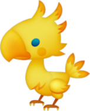

#Davids Memory Match Game

```
A simple memory match game where you match 8 pairs of cards while being timed.
The score is based on number of clicks and also the time it takes you to win.
The game is won when all pairs are matched and flipped.
```



##Prerequisites

```
All you need to play the game is a browser. Google Chrome is recommended as it
was used primarily in testing.
```

##Built with

```
HTML, CSS, Javascript and JQuery.
```

##Contributing

```
This is a project for learning purposes. No contributions are required.
```

##Bugs

```
If you happen to find any bugs while playing the memory match game, please leave
a comment on the main INDEX.html file
```

##Authors

* **David Garrood** - Full Project

##License

```
This project is not licensed.
```

##Acknowledgments

```
In building this project google was heavily used. Forums such as stackoverflow,
websites such as w3schools and documentation such as Mozilla MDN were all used
to assist and reference.
```
